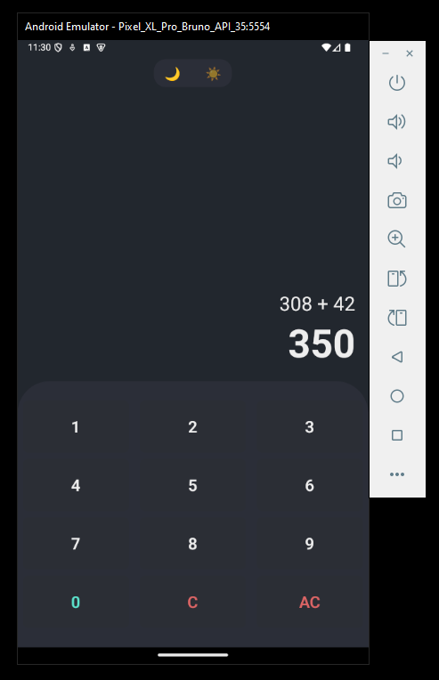
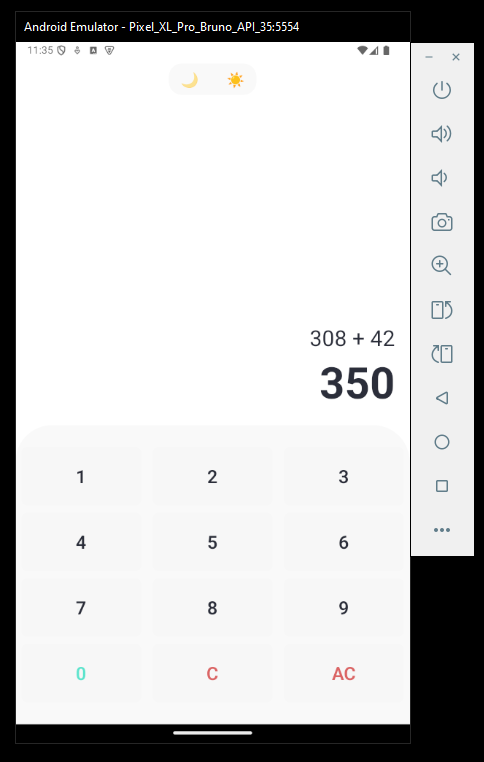

# RN Responsive Calculator

## Overview

A responsive calculator application built with React Native and Expo. This app dynamically adapts to screen sizes and supports light and dark themes. It is optimized for both mobile and web platforms.

## Features

- **Responsive Design:** Automatically adapts to different screen sizes.
- **Dark/Light Themes:** Switch between dark and light themes seamlessly.
- **Orientation Lock:** Forced vertical orientation for a consistent user experience.
- **Customizable Buttons:** Buttons styled dynamically based on screen size and theme.
- **State Management:** Powered by React Context for efficient state handling.

## Installation

### Prerequisites

Ensure you have the following tools installed:

- Node.js (v16 or later)
- Expo CLI

### Steps

1. Clone the repository:

   ```bash
   git clone https://github.com/BrunoBeltreGuzman/rn-responsive-calculator.git
   cd rn-responsive-calculator
   ```

2. Install dependencies:

   ```bash
   npm install
   ```

3. Start the Expo development server:

   ```bash
   npm run start
   ```

4. Run on your preferred platform:
   - Android: `npm run android`
   - iOS: `npm run ios`
   - Web: `npm run web`

## Theming

The application supports light and dark themes. The themes are defined in the `config/Theme.ts` file:

```typescript
const Theme = {
  light: {
    buttonsBackgroundColor: "#E0E0E0",
    buttonsPressedBackgroundColor: "#B0B0B0",
    formulaTextColor: "#000000",
  },
  dark: {
    buttonsBackgroundColor: "#333333",
    buttonsPressedBackgroundColor: "#555555",
    formulaTextColor: "#FFFFFF",
  },
};
```

## Screenshots

Add screenshots or GIFs of your application here.



[Ver video](./docs/video.mp4)

## License

This project is licensed under the MIT License. See the [LICENSE](./LICENSE) file for details.
